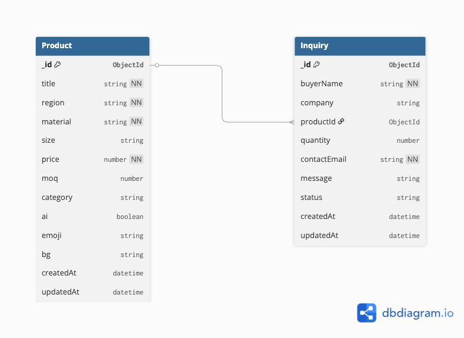

# Shilp Setu

> An AI-powered digital catalog platform connecting rural artisans across India with institutional buyers.

## The Problem

Millions of skilled artisans across rural India — weavers, woodcarvers, potters, embroiderers — produce high-quality handmade products but remain invisible to institutional buyers. They depend on seasonal exhibitions, local middlemen, and word of mouth. Buyers on the other side have no reliable way to discover, evaluate, or order authentic craft products at scale.

## What Shilp Setu Does

Shilp Setu acts as a digital bridge. An NGO coordinator or craft alliance admin uploads a product photo and basic details. Gemini Vision AI automatically generates a professional product description in English (with Hindi translation). Buyers browse a filterable catalog and submit bulk inquiries directly — no brokers, no commission, no exhibitions.

## Core Features

- **AI Description Generator** — Upload a photo, get a publish-ready product description powered by Gemini 1.5 Flash
- **Multilingual Output** — English + Hindi descriptions for wider reach
- **Buyer Catalog** — Filterable by craft type, material, region, and price range  
- **Inquiry Pipeline** — Buyers submit bulk inquiry forms; admin tracks leads (New → Contacted → Confirmed)
- **Admin Dashboard** — Manage listings, availability, and incoming buyer interest in one place

## Tech Stack

| Layer | Technology |
|---|---|
| Frontend | React + Vite, Tailwind CSS |
| Backend | Node.js, Express.js |
| Database | MongoDB Atlas |
| Image Hosting | Cloudinary |
| AI | Gemini 1.5 Flash API |
| Auth | JWT |
| Deployment | Vercel (frontend) + Render (backend) |

## Database

**Choice:** MongoDB Atlas (cloud-hosted NoSQL database)

**Why MongoDB:** Shilp Setu's product data has flexible fields (different crafts have different attributes), making a document-based NoSQL database a natural fit over a rigid relational schema. MongoDB Atlas offers a generous free tier suitable for this project.

### Schema Diagram



### Entities

**Product** — represents a handcraft listing uploaded by an admin/coordinator
- Fields: title, region, material, size, price, moq, category, ai (boolean), emoji, bg, timestamps

**Inquiry** — represents a bulk purchase inquiry from an institutional buyer
- Fields: buyerName, company, productId (ref to Product), quantity, contactEmail, message, status (New/Contacted/Confirmed), timestamps

### Set up the database

1. Create a free MongoDB Atlas account at mongodb.com/cloud/atlas
2. Create an M0 free cluster
3. Add your IP to Network Access
4. Create a database user
5. Get the connection string and add it to your `.env` as `MONGO_URI`
6. Run the backend server — it connects automatically on start
7. Seed initial data: `POST http://localhost:5000/api/seed`


## Project Structure
```
shilp-setu/
├── frontend/          # React + Vite client
│   └── src/
│       └── App.jsx
├── backend/               # Node.js + Express server
│   ├── config/
│   │   └── db.js
│   ├── models/
│   │   ├── Product.js
│   │   └── Inquiry.js
│   ├── routes/
│   │   ├── products.js
│   │   ├── inquiries.js
│   │   └── seed.js
│   ├── middleware/
│   │   └── errorHandler.js
│   ├── server.js
│   ├── .env
│   ├── .env.example
│   └── package.json
├── .gitignore
└── README.md
```

## How to run backend locally

1. Navigate to the backend folder:
```bash
   cd backend
```

2. Install dependencies:
```bash
   npm install
```

3. Create a `.env` file based on `.env.example`:
```bash
   cp .env.example .env
```

4. Start the development server:
```bash
   npm run dev
```

Server runs on `http://localhost:5001`

### API Endpoints

| Method | Endpoint | Description |
|--------|----------|-------------|
| GET | /api/products | Get all products |
| GET | /api/products/:id | Get single product |
| GET | /api/products/search?q= | Search products |
| POST | /api/products | Create new product |
| PUT | /api/products/:id | Update product |
| DELETE | /api/products/:id | Delete product |
| GET | /api/inquiries | Get all inquiries |
| POST | /api/inquiries | Submit inquiry |